# 🚀 Proyecto DAW: AppComercios

Aplicación de contactos de usuarios, comercios y productores de Proximidad

## 👥 Equipo y Contacto

- \*\*Mónica Blanco -- 224J5496
- \*\*Iván Gascón -- 224F4743
- \*\*Javier Rodriguez -- 224A5362

## Índice

    Justificación proyecto
    Objetivos
        Objetivo general
        Objetivos específicos
    Producto mínimo viable
    Metodología
    Diseño BBDD

## Justificación del proyecto:

En una sociedad que prioriza y da valor a la gestión de su tiempo, creamos una aplicación donde ponga al alcance de todos, los productos y servicios cotidianos de primera necesidad y de bienestar en tu zona más próxima
Ponemos en contacto a los productores y emprendedores locales que nos permite obtener los productos de mayor calidad sin necesidad de desplazamientos innecesarios, sin apenas intermediarios
Priorizamos los comercios de barrio y todos aquellos servicios que nos pueden ofrecer nuestros propios vecinos
Detectamos para nuevos emprendedores, ideas y necesidades reales que faltan y que más se demandan en tu zona
Conectamos y creamos una red donde podamos poner al alcance productos y servicios, de forma sencilla y cercana
Creamos acciones sociales de voluntariado para aquellos vecinos que más lo necesiten

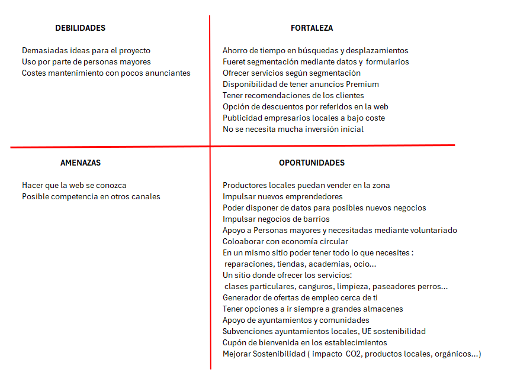

## Objetivos:
    • Objetivo General:
    Crear un espacio donde dispongas de todos los servicios que necesitas a tu alcance
    • Objetivos específicos:
    o Relacionar y poner en contacto consumidores, empresas y productores locales
    o Diseñar una interfaz sencilla y amigable con todas las funcionalidades necesarias para los usuarios
    o Desarrollar un sistema CRUD completo, que sea robusto y seguro

• Scrum board

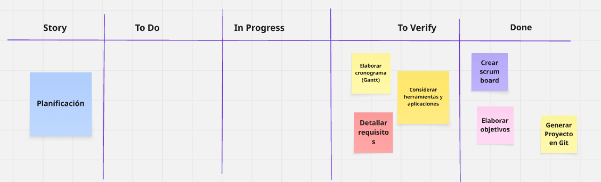
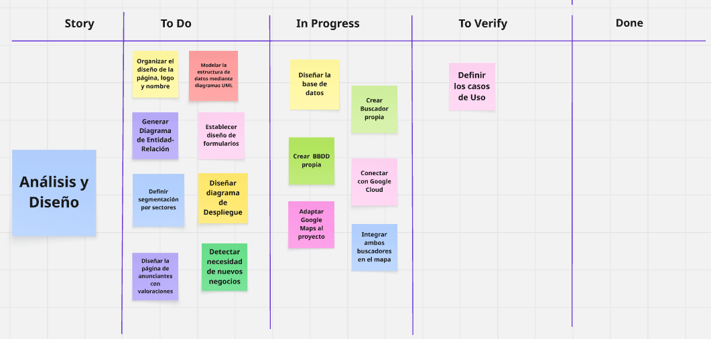
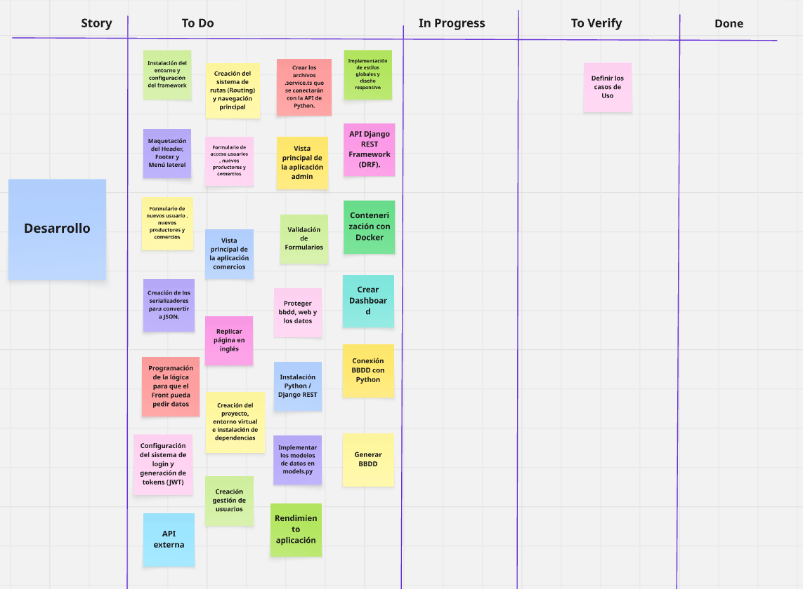
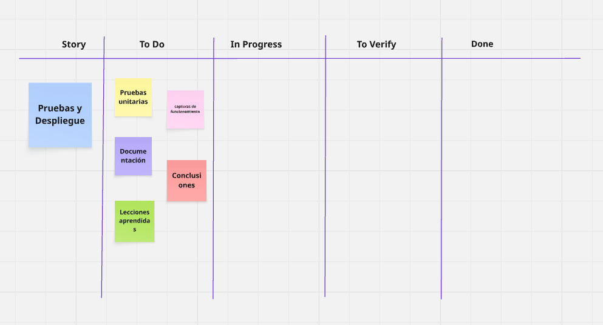

https://miro.com/welcomeonboard/QlptZDU1ZXl1SWJDeUp0RGtESlhlTU1aVk5zZHh6Snp4ak0zckgzdVJRMk5laC84MXdFV1lrN2c2bGRaNW5qWS8wdUFlVUpXN1cvRVpSZ3M4SENGWTJDenVhOXJYVE9oVlFTc2IvUDZ1RzVLdklYM29sak5TY2YzRDVzbW5DU01Bd044SHFHaVlWYWk0d3NxeHNmeG9BPT0hdjE=?share_link_id=920105413377

## Producto mínimo viable

• Requisitos:
        o  Una web sencilla, visual y multidispositivo
        
        o  Se puede registrar un usuario
        
        o  Se registra un comercio
        
        o  Se registra los productores locales
        
        o  Opción Pedir domicilio
        
        o  Un usuario, un comercio y un productor tiene la opción de modificar y eliminar su registro
        
        o  Tiene buscador por zona y distancia
        
        o  Tiene un buscador de comercios
        
        o  Opción de visualizar en mapa
        
        o  Si no es usuario aparece Google Maps
        
        o  Si es usuario aparece Google maps y la propia de la web con datos y descuento
        
        o  Se puede seleccionar por CP, municipio o ciudad y km
        
        o  Menú por secciones
        
        o  Opción de descuento por ser usuario
        
        o  Ofrecer tus servicios
            
        o  Tener un check para participar en voluntariado
        
        o  Tienen valoraciones (estrellas)
        
        o  Sólo valoran usuarios registrados
        
        o  Disponer de buzón sugerencias ante falta de negocios o servicios
        
        o  Aplicación Responsive
        
        o  Disponer de la opción de enviar mensajes a los comercios
        
        o  Disponer de dashboard y métricas de entradas por sección de administrador
        
        o  Disponer de dashboard y métricas de entradas como comercio registrado
        
        o  Seguridad
        
        o  Disponer de servidores
        
        o  Disponer de dockers
        
        o  Página en inglés
        
        o  Página compatible para personas sordomudas
        

## Metodología

Estamos trabajando en el proyecto en Agile con estructura ligera estilo Scrum
    
    •  Nos permite dividir el trabajo en partes pequeñas y funcionales
    •  Flexibilidad y adaptación ante cualquier cambio necesario
    •  Cada entrega es funcional, por tanto el avance del proyecto es significativo
    •  Esto hace que cada tarea sea un progreso visible en el proyecto, lo que confirma que avanza y es más motivador
    •  Podemos detectar los errores según vayamos avanzando y no dejarlos para el final

La forma de trabajo que estamos teniendo es la siguiente:

    •  Dividimos en tareas pequeñas y concretas
    •  Tareas de 1-3 días
    •  Trabajamos en sprints de 1 semana
    •  Lista priorizada de todo lo que hay que hacer a nivel técnico en el proyecto
    •  Utilizando Git con ramas y commits frecuentes.
    •  Priorizaciones

## Diseño BBDD

Diseño Modelo Relacional

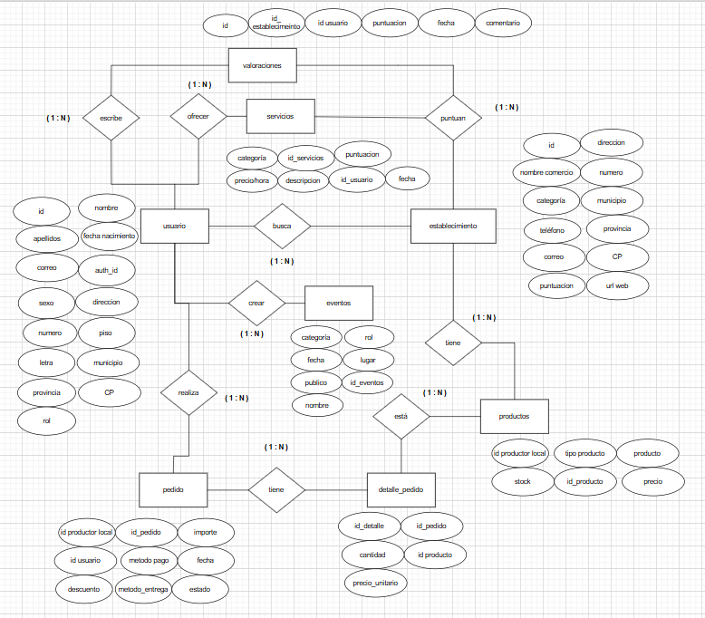

Diseño Modelo Tablas Relacionales

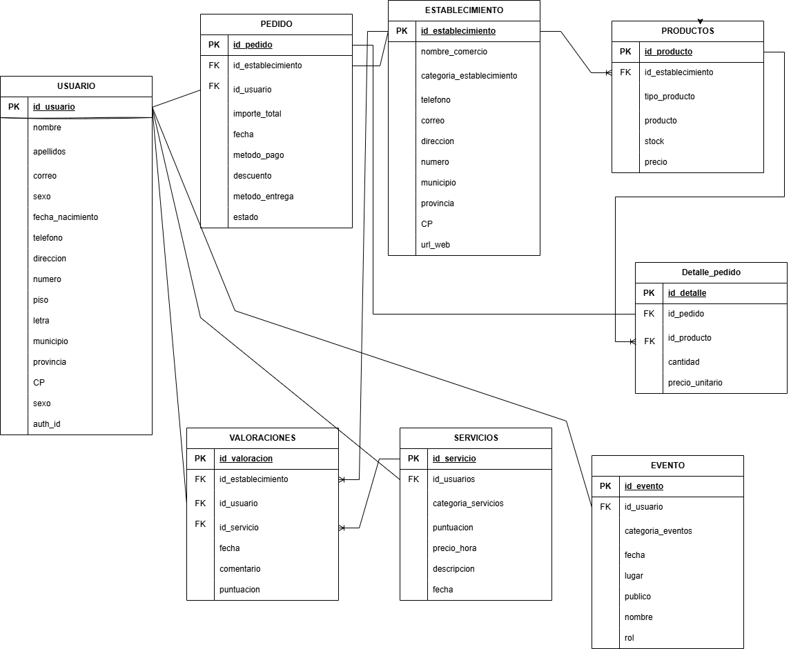

## Diagrama de Gannt

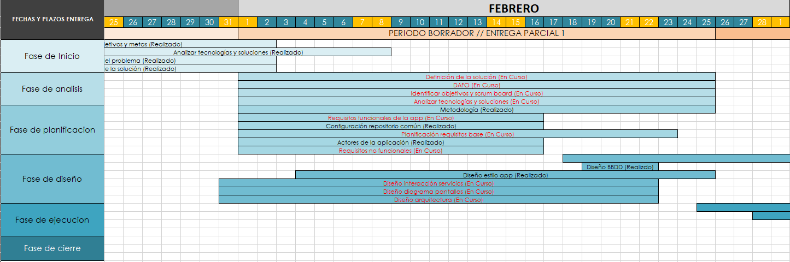

## Diseño App (UI)

    •	Página principal
    
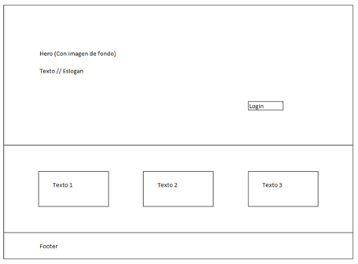

    •	Pagina para que se den alta usuarios y comerciantes

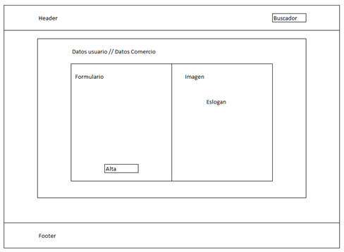

    •	Interfaz la App (Versión 1)
    

    •	Menús desplegables del header

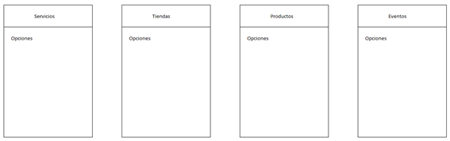

## Paleta de color de la App

    •	La armonía de los colores corporativos de la App se basa en una triada de color en tonos pastel:

        o	Menta (Mint): Transmite una conexión clara con la naturaleza y el bienestar. (Código HEX - #B2D8B2)

        o	Lavanda (Lavender): Transmite conexión con la comunidad y la creatividad. (Código HEX - #D1B3FF)

        o	Melocotón (Peach): Transmite acción y cercanía con una calidez optimista. (Código HEX – #FFCCAC)

